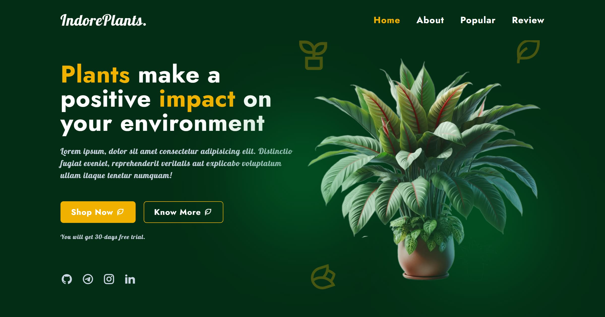

# 🌱 Plants Website

<h3>🌿 Modern Plants Website — Responsive, Animated & Production-Ready</h3>

<strong>Vite</strong> • <strong>TailwindCSS</strong> • <strong>Vanilla JS</strong>

---

A fully responsive plants website built with Vite, TailwindCSS, and Vanilla JavaScript — 
structured across 7 incremental development phases with clean modular architecture and a professional Git workflow. 
Features 6 complete sections with scroll animations, Swiper carousel, WebP-optimized images, 
local fonts and icons, full SEO and Open Graph support, and <strong>Lighthouse 100</strong> on Desktop Performance. 
Live on Vercel, Netlify, and GitHub Pages with automated CI/CD via GitHub Actions.

---

## 🚀 Live Demo

[▲ Vercel](https://khusniddn-plants-website.vercel.app) &nbsp;•&nbsp;
[◈ Netlify](https://khusniddin-plants-website.netlify.app) &nbsp;•&nbsp;
[⬡ GitHub Pages](https://khusniddiniskandarov.github.io/plants-website)

---

## 📸 Previews

### 📺 Screenshots

[🖥️ Desktop](./screenshots/desktop.webp) &nbsp;•&nbsp; [📲 Tablet](./screenshots/tablet.webp) &nbsp;•&nbsp; [📱 Mobile](./screenshots/mobile.webp)

### Quick previews of the project 👇

[🅶🅸🅵](./gif/preview.gif) 👈 <-----< 🔗 >-----> 👉 [🅥🅘🅓🅔🅞](./video/preview.mp4)

---

## 🔗 Links

📂 [Short Repo](https://github.com/KhusniddinIskandarov/plants-website-showcase) &nbsp;•&nbsp;
📖 [Full README](./README.md) &nbsp;•&nbsp;
📚 [Docs](./docs/) &nbsp;•&nbsp;
📂 [Full Repo](https://github.com/KhusniddinIskandarov/plants-website)

---

## 📊 Lighthouse

|                | 🖥️ Desktop | 📱 Mobile  |
| -------------- | :--------: | :--------: |
| Performance    | **100** ✅ | **87** ✅  |
| Accessibility  | **96** ✅  | **100** ✅ |
| Best Practices | **100** ✅ | **100** ✅ |
| SEO            | **100** ✅ | **100** ✅ |

---

## 👨‍💻 Author

**Khusniddin Iskandarov**

---

📄 MIT License — see [LICENSE.md](./LICENSE.md)

